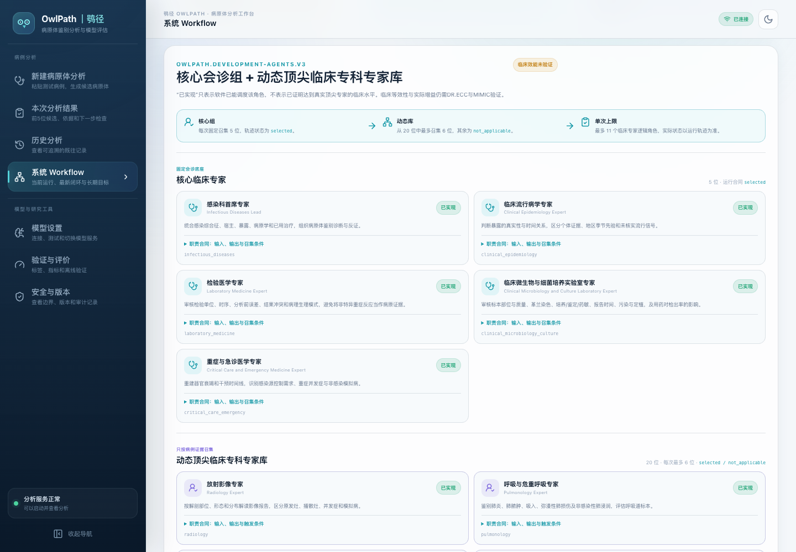

<div align="center">

<picture>
  <source media="(prefers-color-scheme: dark)" srcset="assets/owlpath_logo.svg">
  <source media="(prefers-color-scheme: light)" srcset="assets/owlpath_logo.svg">
  
</picture>

# OwlPath｜鸮径

**把“病原体是什么”变成一条可追溯、可反驳的研究工作流。**

**Turning “what is the pathogen?” into a traceable, falsifiable research workflow.**

[](https://github.com/188097259-web/OwlPath/actions)
[](https://github.com/188097259-web/OwlPath)
[](LICENSE)
[](MEDICAL_DISCLAIMER.md)
[](MEDICAL_DISCLAIMER.md)
[](pyproject.toml)
[](frontend/package.json)
[](https://owlpath-six.vercel.app)

[⚡ 快速开始](#quickstart) · [🔬 研究问题](#research-question) · [🧭 执行链](#pipeline) · [📊 50 例内部结果](#results) · [🧪 验证计划](#validation) · [📚 文档与目录](#docs) · [📄 License](#license)

**简体中文 | [English](README.en.md)**

</div>

<p align="center">
  
</p>

<p align="center">
  <sub><em>治疗按小时，答案常按天——病原学结果尚未返回时，系统性地缩小具体病原体范围。⚠️ 研究原型 · 不是医疗器械 · 不用于诊断或处方 · Top-5 分数为未校准模型分数，不是临床概率。</em></sub>
</p>

---

> **⚠️ 医学免责声明**：OwlPath 是研究原型，**不是医疗器械**，不得用于诊断、处方或替代临床判断。运行中产生的分数是**未校准模型分数**，不是临床概率；固定 Top-5 也不等于确诊 5 种感染。详见 [MEDICAL_DISCLAIMER.md](MEDICAL_DISCLAIMER.md)。

---

## What is OwlPath?｜这是什么

重症感染治疗按小时推进，但病原学答案常按天返回。OwlPath 是一个面向重症感染早期病原体推演的多 AI 专家研究系统：它只使用入 ICU 后 24 小时内已经可见的病史、化验、影像、治疗和待回检查，生成 **5 个具体、可追溯、可由后续检验验证的病原体候选**，并与 5 个单独大语言模型（LLM）和 3 名医生公平比较。

它不自动诊断，也不直接开药；它做的是一件事：把“应该优先对付谁”这个模糊问题，变成一条保留证据、分工审阅、独立反驳的研究工作流。

| 步骤 | 动作 |
|---|---|
| 01 冻结证据 | 只取入 ICU 后 24 小时内信息 |
| 02 AI 专家会诊 | 从感染、检验、暴露等角度分析 |
| 03 整理与检索 | 去重线索，查询公开医学证据 |
| 04 总诊与审稿 | 排序候选，并主动找遗漏和反证 |
| 05 输出与验证 | 给出 Top-5，再用后续结果评分 |

---

<a id="research-question"></a>

## 研究问题与证据缺口｜Research Question & Evidence Gap

**真实问题：治疗按小时，答案常按天。** 重症感染患者往往需要在数小时内开始治疗，但找出具体致病微生物通常需要更久。等待检验结果时，医生只能综合病史、接触经历、化验和影像先作判断——困难不是没有抗菌药、抗真菌药或抗病毒药，而是不知道应优先对付谁。

**核心研究问题**：在相同病例和相同时间点下，多 AI 专家协作能否比单独 LLM 和本次参与比较的 3 名医生，更准确地把真实病原体排到前面？

| 要素 | 定义 |
|---|---|
| 对象 | 首次进入重症监护病房（ICU）的成人重症感染疑似患者 |
| 输入 | 只使用入 ICU 后 24 小时内已经可见的病史、化验、影像、治疗和待回检查 |
| 输出 | 5 个具体病原体 + 支持证据、反对证据、不确定性与下一项优先检查 |
| 验证 | 24 小时后才出现的培养、核酸检测和最终诊断只用于评分，绝不进入预测 |

**证据缺口**：

- **>1,400 种**：经典文献目录中的人类病原体，目录仍在更新（Taylor 等，2001）。
- **4,890 万 / 1,100 万**：2017 年全球脓毒症病例数 / 相关死亡估计（Rudd 等，Lancet，2020）。
- **数十小时至数天**：许多病原体检测从送检到完整答案所需时间。

问题仍未解决的三重原因：不同病原体可产生相似表现，且分布随地区、季节、接触经历和患者自身情况变化；关键线索散落在病史、化验、影像和治疗记录中，可能缺失、矛盾或尚未返回；普通 LLM 可能直接给答案，却不保留证据来源和时间边界，也缺少公平、可复现的比较。检验策略取向遵循 IDSA/ASM 2024 感染性疾病实验室诊断指南。

---

<a id="pipeline"></a>

## 方法与执行链｜Method & Execution Pipeline

```text
原始病例全文
  ↓
稳定来源片段 + 冻结输入快照
  ↓
复杂度/专病路由
  ↓
5 位固定核心专家 + 从 20 位动态专家中最多选 6 位
  ↓
证据委员会去重 + 检索规划
  ↓
文献/公共卫生线索检索 + 证据核验
  ↓
病原体总诊 Agent
  ↓
NCBI Taxonomy 解析 + 确定性 Top-5 合同
  ↓
独立审稿 Agent
  ↓
必要时最多修订一次
  ↓
双语结果 + 执行图 + 哈希完整性记录
```

开发路径使用 `owlpath.result.v3`、`owlpath.execution-graph.v4` 和 `owlpath.trace.v2`。一次运行选择 **5–11 个临床专家角色**；专科阶段最多 **12 次 Provider 请求**；全程真实网络请求上限 **18 次**；开发运行硬截止 **420 秒**。

**公平原则**：OwlPath、5 个单独 LLM 和 3 名医生看到同一份 24 小时病例快照；未来结果只负责判分，不能提前进入任何一方的答案。

**记录与隐私**：保存运行编号、输入版本、参与 AI 专家、候选变化、证据来源、审稿意见、耗时、成本与失败原因；不保存 API Key、患者身份信息、未经处理的模型原始响应和模型内部隐藏推理。MIMIC 与本地患者数据只在获批环境使用；文献搜索仅接收去标识化概念。

### 六条不可改变的规则｜Six Invariant Rules

| # | 规则 | 含义 |
|---|---|---|
| 1 | 统一起点 | 全部在入 ICU 后 24 小时预测 |
| 2 | 禁止偷看 | 24 小时后的结果不能进入输入 |
| 3 | 信息公平 | 所有方法看到相同资料，并都给 5 个候选 |
| 4 | 答案具体 | 不能用“细菌、病毒”等大类代替 |
| 5 | 证据可追溯 | 每个结论都能指回病例线索 |
| 6 | 研究边界 | 不自动诊断、不开药、不替代医生 |

### 版本轴｜Version Axis

| 版本轴 | 当前值 | 含义 |
|---|---|---|
| 公开比赛研究版 | `v0.1.0` | 首个获批公开的研究软件版本 |
| 前后端软件包 | `0.1.0` | Python/Node 包版本 |
| HTTP 服务 | `0.1.0-research` | `/api/health` 报告的研究服务版本 |
| 开发 Agent 引擎 | `0.2.0-development-agents` | 开发运行的编排实现版本 |
| 治理声明 | `0.2.0-research` | 随运行冻结的研究治理规则版本 |
| 架构目录 | `3.0.0-elite-specialist-team` | 5 位核心、20 位动态专家配置版本 |
| 结果 / 执行图 / 轨迹合同 | `result.v3` / `execution-graph.v4` / `trace.v2` | 三类 API 数据结构版本 |

---

<a id="results"></a>

## 结果｜Results（50 例内部探索性比较）

> 内部探索性观察，**无 95% 置信区间、非临床验证**。50 个独立病例；3 名医生每人评估 50 例，每种医生条件共 150 次医生-病例判断。现有 Excel 只保留每位医生的 50 例汇总，没有逐病例配对记录与完整盲法流程。

| 测试条件 | 方法/人员 | Top-1 | Top-3 | Top-5 |
|---|---:|---:|---:|---:|
| 多 AI 专家 | **OwlPath** | **11/50（22%）** | **34/50（68%）** | **43/50（86%）** |
| 单独 LLM | GPT-5.6 | 7/50（14%） | 22/50（44%） | 39/50（78%） |
| 单独 LLM | Fable 5 | 8/50（16%） | 19/50（38%） | 31/50（62%） |
| 单独 LLM | Gemini 3.1 Pro | 6/50（12%） | 18/50（36%） | 27/50（54%） |
| 单独 LLM | DeepSeek V4 pro | 4/50（8%） | 20/50（40%） | 37/50（74%） |
| 单独 LLM | Qwen 3.8 max | 7/50（14%） | 21/50（42%） | 32/50（64%） |
| 医生独立 | 住院医师 | 4/50（8%） | 9/50（18%） | 13/50（26%） |
| 医生独立 | 主治医师 | 7/50（14%） | 14/50（28%） | 18/50（36%） |
| 医生独立 | 主任医师 | 6/50（12%） | 16/50（32%） | 25/50（50%） |
| 医生独立 | 汇总（150 次医生-病例判断） | 17/150（11.3%） | 39/150（26.0%） | 56/150（37.3%） |
| 医生＋工具 | 住院医师 | 6/50（12%） | 16/50（32%） | 25/50（50%） |
| 医生＋工具 | 主治医师 | 8/50（16%） | 17/50（34%） | 24/50（48%） |
| 医生＋工具 | 主任医师 | 9/50（18%） | 21/50（42%） | 27/50（54%） |
| 医生＋工具 | 汇总（150 次医生-病例判断） | 23/150（15.3%） | 54/150（36.0%） | 76/150（50.7%） |

与各指标最强的非 OwlPath 结果相比，OwlPath 的 Top-1、Top-3、Top-5 分别高 **6、24、8 个百分点**。该差异仍属内部探索性观察，不构成临床有效性结论。

**正确读法**：这是 50 个独立病例，不是 150 个病例；150 是 3 名医生 × 50 例的“医生-病例”判断次数；没有逐病例配对记录、95% 置信区间与完整盲法流程，因此不能外推为临床诊断准确性。

---

## 公平性四参照｜Four Fairness Comparators

1. **常见病原体固定名单**——排除“只重复最常见答案”带来的假优势；
2. **随机选择 5 种病原体**——检验是否明显超过随机水平；
3. **同模型、同预算的非 Agent 流程**——检验提升是否来自多 AI 专家协作、检索与审稿；
4. **本次参与比较的 3 名医生**——相同信息、时间点、候选数量下，检验是否提供额外价值。

---

<a id="validation"></a>

## 验证计划｜Validation Plan

| 阶段 | 数据 | 目的 |
|---|---|---|
| 1. DR.ECC 本地探索 | 中国本土多模态急诊与重症数据库（项目负责人为 DR.ECC 创始人） | 队列设计与内部探索 |
| 2. DR.ECC 时间验证 | DR.ECC 较晚时期病例 | 冻结提示词与系统配置后检验时间泛化 |
| 3. MIMIC 外部验证 | 美国去标识化重症数据库 | 外部泛化；不再调参 |

**一次完整试跑**：预先锁定病例、真值规则、主要指标和统计方案 → 生成 24 小时快照并隐藏后续答案 → 三方给 5 候选 → 用后续微生物检测和独立专家判定形成验证答案 → 同一病例比较，报告总体结果、失败病例与模块贡献。

**主要风险与应对**：

| 风险 | 应对 |
|---|---|
| 未来信息泄漏 | 检查发生时间与医生可见时间 |
| 真值不可靠 | 区分真正致病、污染与仅存在未致病 |
| 比较条件不公平 | 同病例、同时点、同 5 候选 |
| 地区与病例选择偏差 | 公开队列筛选流程 |
| 模型检索或隐私故障 | 失败病例计入分母并保留日志 |

### 复现与开源计划｜Reproducibility & Open-Source Plan

计划开源系统代码、提示词、输出规则、评价脚本、环境配置、合成示例和匿名汇总结果，并提供一条命令完成演示与测试。MIMIC 与本地患者级数据、API Key 以及可能重新识别患者的信息不公开。

---

<a id="limitations"></a>

## 局限与失败定义｜Limitations & Failure Definitions

**科学边界**：本次仍是 50 个独立病例，不是 150 个病例；无逐病例配对记录、95% 置信区间与完整盲法流程，因此属内部探索性观察。

**最低成功**：Top-3 为主要指标；Top-1/3/5 均高于最强参照；不确定范围支持提升并非偶然；技术失败计入全部病例；DR.ECC 时间验证与 MIMIC 外部验证方向一致。

**明确失败**：使用 24 小时后信息；只在 Top-5 或少数病例改善；比较信息不同；真值标签不可靠；本地有效但外部验证消失。

**失败也有价值**：若只有 Top-5 改善 → 定位为候选生成工具；若只在复杂病例有效 → 缩小适用范围；若只在本地数据库有效 → 研究地区差异并重新校准。

**当前证据边界**：多 Agent 执行、合同、失败隔离和可追溯性有工程测试覆盖；`benchmarks/` 只含 50 例内部初步比较聚合数；MIMIC 与 DR.ECC 验证尚未作为本仓库发布结果；外部文献主要为题名/元数据级线索；Docker 冷启动与真实 Provider 验证仍是后续工作。

---

<a id="quickstart"></a>

## Quickstart｜快速开始

**环境**：Python 3.10+（CI 覆盖 3.10/3.11/3.12，本地参考 3.11）、Node.js 22.18+。

```bash
git clone https://github.com/188097259-web/OwlPath.git OwlPath
cd OwlPath
./scripts/setup.sh
./scripts/start.sh
```

打开 `http://127.0.0.1:8000`。开发热更新 `./scripts/dev.sh`；环境检查 `./scripts/doctor.sh`；macOS 本机服务 `./scripts/service.sh install`。

### Docker

```bash
docker compose up --build
```

默认只绑定 `127.0.0.1:8000`。Docker 冷启动尚未实测，不得改写为“已验证”。

### 模型配置

网页“模型与 API”页面添加 Provider、模型 ID 与 API Key；API Key 仅存本地加密密钥库、不回显；自动测试使用模拟 Provider，不发起收费请求。真实 Provider 调用可能产生费用；非纯合成文本必须先确认数据授权、去标识化级别与 Provider 数据政策。

### 测试与发布前审计

```bash
make test
python3 scripts/synthetic_regression.py --self-test
python3 scripts/repository_audit.py
```

`make test` 运行后端全量测试、前端测试和生产构建。

### 运行 URL 与主要 API

```text
#/runs/{run_id}/progress
#/runs/{run_id}/result
#/runs/{run_id}/result?tab=trace
#/runs/{run_id}/compare
```

主要 API：`POST /api/development/runs`、`GET /api/runs/{run_id}`、`GET /api/runs/{run_id}/events`、`GET /api/runs/{run_id}/trace`、`GET /api/runs/{run_id}/trace/nodes/{node_id}`、`GET /api/architecture`。

### Vercel 线上入口

线上研究版部署在 <https://owlpath-six.vercel.app>。`GET /api/health` 返回：

```json
{
  "status": "ok",
  "service": "OwlPath（鸮径）",
  "version": "0.1.0-research",
  "clinical_validation": "not_validated",
  "research_only": true
}
```

请勿向线上环境输入真实患者信息；该部署仅用于研究演示，且使用临时存储，配置与运行记录可能因冷启动重置。

---

<a id="docs"></a>

## 文档与目录｜Docs & Repository Layout

| 我想… | 从这里开始 |
|---|---|
| 理解系统如何组织 | [架构文档](docs/08_agent_architecture.md) |
| 查看专家角色与提示词 | [提示词手册](docs/12_elite_clinical_specialist_prompt_library.md) |
| 理解 50 例基准与边界 | [基准说明](benchmarks/BENCHMARK_CARD.md) |
| 了解安全与报告方式 | [安全政策](SECURITY.md) |
| 阅读医学用途限制 | [医学免责声明](MEDICAL_DISCLAIMER.md) |
| 了解后端运行细节 | [后端与运行说明](backend/README.md) |

```text
backend/      FastAPI、Provider 适配、编排、检索、术语和持久化
frontend/     React + TypeScript 研究控制台
config/       Agent 注册、术语表、用途边界和发布门
prompts/      提示词源文件索引
schemas/      v3 结果/执行合同索引
docs/         架构、隐私、评价、演示与提示词手册
examples/     明确纯合成、可公开的样例
benchmarks/   仅聚合、非患者级的内部探索性比较
scripts/      安装、运行、回归和仓库审计
releases/     版本化发布记录、SBOM 与 SHA-256 manifest
data/         运行时数据；除 README 外不进入 Git
```

---

## 引用｜References

- Taylor 等（2001）。人类病原体经典目录；目录仍在更新。
- Rudd 等（Lancet，2020）。全球脓毒症负担：2017 年约 4,890 万病例、1,100 万相关死亡。
- IDSA / ASM（2024）。感染性疾病实验室诊断指南。

---

## License

OwlPath 自有代码、文档与本仓库标明为项目自有的视觉资产按 [MIT License](LICENSE) 公开，署名 **OwlPath Project Team**。医学知识、指南、数据库、第三方 API、模型及软件依赖仍受各自许可、隐私政策与使用条款约束。一般问题请使用 [GitHub Issues](https://github.com/188097259-web/OwlPath/issues)；敏感安全问题请使用 [Private Vulnerability Reporting](https://github.com/188097259-web/OwlPath/security/advisories/new)，不要在公开 Issue 中粘贴密钥、漏洞细节或临床文本。

---

> **再次提醒：OwlPath 是研究原型，不是医疗器械。** 运行中产生的分数是未校准模型分数，不是临床概率；固定 Top-5 不等于确诊 5 种感染。不得用于诊断、处方或替代临床判断。
