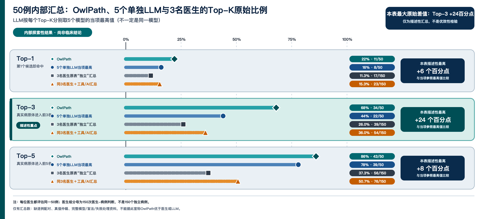

# OwlPath 50 例内部汇总比较：Benchmark Card

> **状态：内部探索性结果，不是临床验证。**  
> 本目录只包含聚合数据，不包含病例、医生姓名、患者信息或逐例预测。

## 目的

初步查看来源表在同一批 50 例病原学测验中记录的 Top-1、Top-3 和 Top-5 汇总命中情况。来源表包含 OwlPath、5 个单独 LLM，以及 3 名医生的未辅助与“工具/AI 辅助”条件。该比较只用于形成后续研究假设，不能证明 OwlPath 优于医生或任何模型。

## 证据状态

- 本仓库能复核的是 `aggregated_results.csv` 中的**汇总计数、分母和百分比算术**；
- 汇总数由项目负责人提供，但本公开仓库没有逐例预测和真值记录，因而**不能独立重现或核实命中计数**；
- “独立”、“工具/AI 辅助”、职称和模型名称是来源表标签，不代表本仓库已验证实际实验流程、模型精确版本或医生资历。

## 计数单位

- 存在 **50 个独立病例**；
- OwlPath 和每个单独 LLM 各有 50 个病例级排序；
- 3 名医生每人完成同一批 50 例，所以每个医生条件有 **150 次“医生×病例”判断**；
- 150 不是 150 个独立病例，Top-1/3/5 也不是三组独立样本，而是从同一排序派生的嵌套指标。
- OwlPath/LLM 的分母为 50 例，医生汇总分母为 150 次聚类的“医生×病例”判断；直接并列百分比只供描述，不是合格的优效性检验。

## 聚合结果

| 系统/条件 | Top-1 | Top-3 | Top-5 |
|---|---:|---:|---:|
| **OwlPath** | **11/50（22%）** | **34/50（68%）** | **43/50（86%）** |
| 5 个单 LLM 中的当项最高汇总值¹ | 8/50（16%） | 22/50（44%） | 39/50（78%） |
| 3 名医生独立判断合并 | 17/150（11.3%） | 39/150（26.0%） | 56/150（37.3%） |
| 同 3 名医生 + 工具/AI 合并 | 23/150（15.3%） | 54/150（36.0%） | 76/150（50.7%） |

逐系统和逐医生聚合计数见 [`aggregated_results.csv`](aggregated_results.csv)。

¹ Top-1 的当项最高值来自 Fable，Top-3 和 Top-5 来自表中标注为 GPT-5.6 的行；该参照不是一条由同一模型产生的统一曲线。

## 当前不能回答的问题

现有公开工件没有逐例配对记录和完整方法学资料，因此以下内容均为**未知或不可核实**：

- 50 例的选择、连续性、重复情况、排除规则与病原谱构成；
- 金标准来源、真值仲裁、争议病例处理与多病原标签计分规则；
- 所有模型的提供方、精确模型 ID/版本/日期、提示词、采样参数、检索工具、上下文长度、重试和费用；
- 3 名医生的准确专业背景、经验年限、招募方式、盲法、信息边界、阅读顺序、用时和学习/记忆效应；
- “工具/AI 辅助”的具体工具、版本、使用方式及干预顺从性；
- 运行失败、空答案、弃答、超时和排除是否按预先规则全部计入分母；
- 95% 置信区间、病例配对/医生内聚类分析、统计显著性、效应量和多重比较校正。

因此，该结果的准确表述是：

> 来源汇总表中，OwlPath 这一行的 Top-1、Top-3 和 Top-5 原始比例均高于表中所列参照行。由于无法在公开仓库中核实逐例真值、方法与配对数据，这只是待验证的描述性信号，**不构成 OwlPath 优于医生或 LLM 的证据**，也不能推断统计显著性、因果效益或外部可推广性。

## 下一步正式验证

1. 冻结 ICU 入科 +24 小时的输入可见性规则与病原真值仲裁规则；
2. 保存不公开的逐例预测，按病例配对计算 Top-K、MRR、失败率和 95% CI；
3. 同模型、同信息、同费用设置单 LLM、无检索/无审稿消融与完整 OwlPath；
4. 使用 DR.ECC 时间外队列与 MIMIC 独立外部队列分开报告，不混合调参；
5. 仅公开代码、队列定义、聚合指标和纯合成演示，不公开 MIMIC/DR.ECC 病例级内容。
